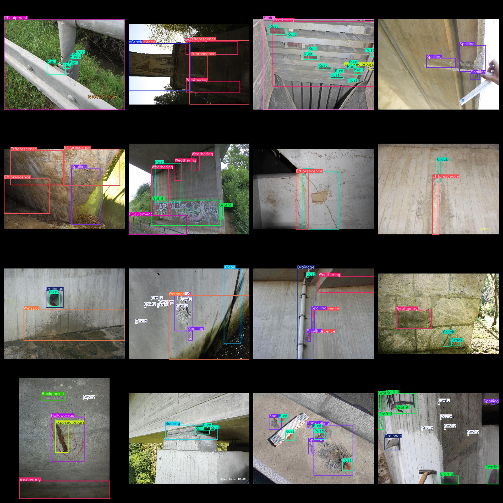
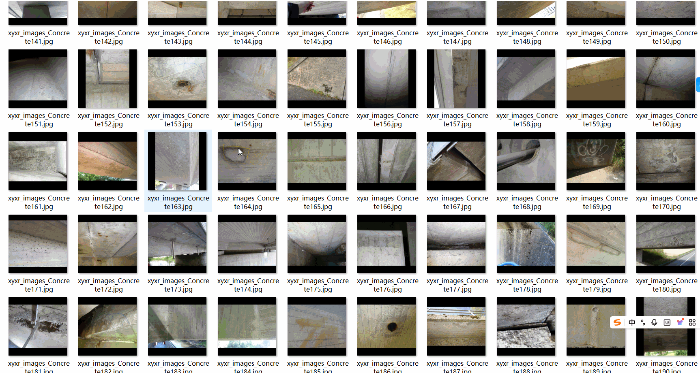

# [Object Detection] Concrete Defect Dataset 7755 imagesYOLO+VOC format

【Target Detection】Concrete Defects Dataset 7,755 Images in YOLO + VOC Format

According to the format: VOC format + YOLO format.

The compressed file contains: three folders, each storing images, xml files, and text files.

Total jpg images in JPEGImages folder: 7755

The total number of XML files in the Annotations folder is 7755.

The total number of txt files in the labels folder is 7755.

Number of tag types: 20

Tag names: ["ACrack","Bearing","Cavity","Crack","Drainage","EJoint","Efflorescence","ExposedRebars","Graffiti","Hollowareas","JTape","PEquipment","Restformwork","Rockpocket","Rust","Spalling","WConccor","Weathering","Wetspot","object"]

The number of boxes for each label (Note that the order of labels in the Yolo format does not correspond to this, but is based on the classes.txt file in the labels folder):

ACrack frame count = 419

Bearing frame count = 1188

Cavity frame count = 9047

Crack frame count = 3562

Drainage frame count = 1624

EJoint frame count = 502

Efflorescence frame count = 3926

ExposedRebars frame count = 1972

Graffiti frame count = 2176

Hollowareas frame count = 1446

JTape frame count = 1064

PEquipment frame count = 1883

Restformwork frame count = 999

Rockpocket frame count = 608

Rust frame count = 14481

Spalling frame count = 9684

WConccor frame count = 405

Weathering frame count = 4585

Wetspot frame count = 1641

object frame count = 13

Total boxes: 61225

Picture clarity (Resolution: Pixels): Clear

Is the image enhanced: No

Shape of the label: Rectangular box, used for object detection and recognition.

Important Note: None

Special Notice: This dataset does not guarantee the accuracy or precision of the trained models or weight files. The dataset only provides accurate and reasonable annotations.

## Images

---

Here is a pay link on Stripe (https://buy.stripe.com/3cs8yP7sY87d0vu9AB). Please contact me lonlonago@foxmail.com after funding $89, and I will send you a complete data files, thank you!

